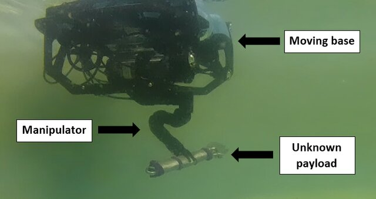

# Differentiable Dynamics for Underwater Vehicle and Manipulator System 🦾🌊
A library for generating the kinematics and dynamics of electric underwater robotic arm under a moving base.
<!--  -->

## Todo/Implementation status
- [x] [whole-body Forward Dynamics](https://github.com/edxmorgan/diff_uvms/blob/main/usage/example/uvms_forward_dynamics.ipynb)
- [x] [whole-body Inverse Dynamics](https://github.com/edxmorgan/diff_uvms/blob/main/usage/example/uvms_dynamics.ipynb)
- [x] [whole-body forward kinematics](https://github.com/edxmorgan/diff_uvms/blob/main/usage/example/kinematics.ipynb)
- [ ] whole-body Inverse kinematics
- [x] [Model Identification Regressor](https://github.com/edxmorgan/diff_uvms/blob/main/usage/example/uvms_for_identification.ipynb)
- [ ] [UVMS PID Controller](https://github.com/edxmorgan/diff_uvms/blob/main/usage/example/uvms_pid)

For usage examples of Diff_UVMS, see [Jupyter notebook](https://github.com/edxmorgan/Diff_UVMS/tree/main/usage/example).

Dynamics of moving base (underwater vehicle) used in [UVMS foward dynamics example](https://github.com/edxmorgan/diff_uvms/blob/main/usage/example/uvms_forward_dynamics.ipynb) are derived from the [Diff_UV (Differentiable Underwater Vehicle System)](https://github.com/edxmorgan/Diff_UV) project.

## References
Roy Featherstone and Kluwer Academic Publishers. 1987. Robot Dynamics Algorithm. Kluwer Academic Publishers, USA. http://dx.doi.org/10.1007/978-1-4899-7560-7

Fossen, T.I. (2011) Handbook of Marine Craft Hydrodynamics and Motion Control. John Wiley & Sons, Inc., Chichester, UK. https://doi.org/10.1002/9781119994138